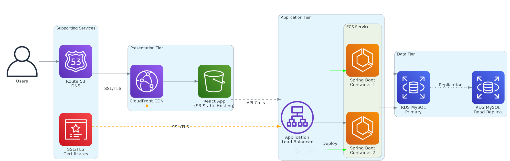
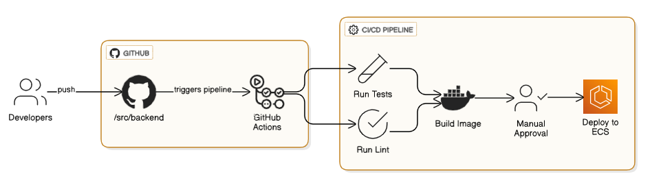

# Three-Tier DevOps AWS Platform


A production-style three-tier DevOps project that deploys a **React frontend**, **Spring Boot backend**, and **MySQL database** on AWS using **Terraform**, **ECS Fargate**, **RDS**, **S3**, **CloudFront**, **Route 53**, **GitHub Actions**, and DevSecOps automation.

This repository keeps the original application recipe intact and upgrades the platform layer to show modern cloud engineering practices: secure CI/CD, infrastructure as code, containerization, security scanning, SBOM generation, drift detection, CloudWatch-ready operations, and AI-ready release summaries.

---


## 🚀 Project Highlights

- Three-tier architecture: **Frontend + Backend API + Database**
- React SPA hosted through **S3 + CloudFront**
- Spring Boot backend containerized and deployed on **ECS Fargate** behind an **Application Load Balancer**
- MySQL database using **Amazon RDS** with encryption, backups, and optional Multi-AZ
- Modular **Terraform IaC** for network, frontend, backend, database, and domain layers
- GitHub Actions CI for frontend, backend, Terraform quality, CodeQL, dependency review, Trivy, and SBOM artifacts
- AWS deployment workflow prepared for **OIDC-based authentication**, avoiding long-lived AWS keys in GitHub secrets
- Operational docs, runbook, screenshots guide, security notes, and portfolio/interview notes
- Optional GenAI-style release summary script for DevOps reporting

---

## 🏗️ Architecture



### High-Level Flow

```text
Users
  ↓
Route 53 + CloudFront
  ↓
S3 Static Frontend
  ↓
Application Load Balancer
  ↓
ECS Fargate Spring Boot API
  ↓
Amazon RDS MySQL
```

### AWS Components

| Layer | Services |
|---|---|
| Frontend | S3, CloudFront, ACM, Route 53 |
| Backend | ECS Fargate, ALB, ECR-ready container image, CloudWatch logs |
| Database | RDS MySQL, private subnets, security groups, encryption, backups |
| Network | VPC, public subnets, private subnets, NAT Gateway, security groups |
| CI/CD | GitHub Actions, OIDC-ready AWS auth, Trivy, CodeQL, Checkov, TFLint |
| Security | IAM least privilege pattern, TLS, security headers, encrypted storage, no committed state/secrets |

---

## 📸 Project Snapshots

### Application Overview


### Frontend CI/CD Flow


### Backend CI/CD Flow



### Infrastructure CI/CD Flow


---

## 🛠️ Tech Stack

### Application

- React
- Spring Boot
- Java 11
- MySQL
- Docker Compose

### DevOps / Cloud

- AWS ECS Fargate
- AWS RDS MySQL
- AWS S3 + CloudFront
- AWS Route 53 + ACM
- Terraform
- Docker
- GitHub Actions
- Trivy
- CodeQL
- Checkov
- TFLint
- CycloneDX SBOM

---

## 📁 Project Structure

```text
.
├── .github/
│   ├── dependabot.yml
│   └── workflows/
│       ├── frontend-ci.yml
│       ├── backend-ci.yml
│       ├── terraform-quality.yml
│       ├── deploy-aws-oidc.yml
│       ├── terraform-drift.yml
│       ├── codeql.yml
│       └── dependency-review.yml
├── docs/
│   ├── ARCHITECTURE.md
│   ├── RUNBOOK.md
│   ├── GENAI_ENHANCEMENT.md
│   └── SCREENSHOTS.md
├── infra/
│   ├── modules/
│   │   ├── network/
│   │   ├── frontend/
│   │   ├── backend/
│   │   ├── db/
│   │   └── domain/
│   ├── envs/
│   │   ├── dev.tfvars
│   │   └── prod.tfvars
│   └── *.tf
├── scripts/
│   └── genai_release_summary.py
├── src/
│   ├── frontend/
│   ├── backend/
│   ├── db/
│   └── docker-compose.yml
├── SECURITY.md
├── PORTFOLIO_NOTES.md
├── GITHUB_UPLOAD_STEPS.md
└── README.md
```

---

## ⚙️ Local Development

### 1. Start the full stack locally

```bash
cd src
docker compose up --build
```

Access locally:

```text
Frontend: http://localhost:4200
Backend:  http://localhost:8080
Health:   http://localhost:8080/actuator/health
MySQL:    localhost:3306
```

### 2. Stop local stack

```bash
cd src
docker compose down
```

### 3. Run production-style local containers

```bash
cd src
docker compose -f docker-compose.prod.yml up --build
```

---

## 🧪 CI/CD Workflows

| Workflow | Purpose |
|---|---|
| `frontend-ci.yml` | Install, lint, test, build React app, Trivy scan, generate frontend SBOM |
| `backend-ci.yml` | Run Spring Boot tests with MySQL service, package app, build Docker image, Trivy scan, generate backend SBOM |
| `terraform-quality.yml` | Terraform fmt, init, validate, TFLint, Checkov scan |
| `deploy-aws-oidc.yml` | Manual AWS deployment workflow using GitHub OIDC and Terraform plan |
| `terraform-drift.yml` | Scheduled/manual drift detection and GitHub issue creation when drift is found |
| `codeql.yml` | CodeQL scanning for Java and JavaScript/TypeScript |
| `dependency-review.yml` | Pull request dependency risk review |

---

## 🔐 Security Improvements Added

- Removed local TLS `.pem` files from source control
- Added root `.gitignore` for state files, secrets, env files, cache, and generated reports
- Replaced hardcoded application credentials with environment variable placeholders
- Added backend actuator health endpoint configuration
- Added frontend security headers in NGINX
- Fixed backend Docker port mismatch
- Added Docker health checks
- Added RDS encryption and backup retention variables
- Added S3 block-public-access and server-side encryption configuration
- Marked Terraform database password as sensitive
- Added GitHub Actions OIDC-based AWS workflow design
- Added Trivy, CodeQL, Checkov, TFLint, Dependabot, and SBOM workflow support

---

## ☁️ Terraform Deployment

> This project can create real AWS resources and may create AWS costs. Review variables before running `terraform apply`.

### 1. Configure backend and credentials

Use AWS CLI locally, AWS CloudShell, or GitHub Actions OIDC. Do not commit AWS access keys.

```bash
cd infra
terraform init
```

### 2. Select workspace

```bash
terraform workspace new dev || terraform workspace select dev
```

### 3. Plan

```bash
terraform plan -var-file=envs/dev.tfvars -var="db_password=REPLACE_WITH_SECURE_PASSWORD"
```

### 4. Apply

```bash
terraform apply -var-file=envs/dev.tfvars -var="db_password=REPLACE_WITH_SECURE_PASSWORD"
```

### 5. Destroy when finished

```bash
terraform destroy -var-file=envs/dev.tfvars -var="db_password=REPLACE_WITH_SECURE_PASSWORD"
```

---

## 🤖 Optional GenAI Release Summary

This project includes an offline AI-ready summary script that can convert commit history and pipeline artifacts into a release summary. It can later be connected to Amazon Bedrock, OpenAI, or an internal enterprise AI gateway.

```bash
python scripts/genai_release_summary.py --mode offline
```

Read more in [`docs/GENAI_ENHANCEMENT.md`](docs/GENAI_ENHANCEMENT.md).

---

## 📚 Documentation

- [`docs/ARCHITECTURE.md`](docs/ARCHITECTURE.md)
- [`docs/RUNBOOK.md`](docs/RUNBOOK.md)
- [`docs/GENAI_ENHANCEMENT.md`](docs/GENAI_ENHANCEMENT.md)
- [`docs/SCREENSHOTS.md`](docs/SCREENSHOTS.md)
- [`SECURITY.md`](SECURITY.md)
- [`PORTFOLIO_NOTES.md`](PORTFOLIO_NOTES.md)
- [`GITHUB_UPLOAD_STEPS.md`](GITHUB_UPLOAD_STEPS.md)

---

## 🎯 Career Progression Value

This project shows progression from application deployment to cloud platform engineering:

```text
Docker Compose local stack
  → Terraform-managed AWS infrastructure
  → ECS Fargate production-style runtime
  → GitHub Actions CI/CD
  → DevSecOps scanning and SBOM generation
  → Drift detection and OIDC authentication
  → AI-ready DevOps release reporting
```


## ✅ GitHub Actions Status

This final clean portfolio version keeps one safe workflow active by default: **Portfolio Validation**. It validates repository structure, README contact links, and the offline GenAI-style release summary helper.

Advanced workflows for frontend CI, backend CI, Terraform quality, CodeQL, dependency review, AWS OIDC deployment, and drift detection are preserved under `.github/workflows-disabled/`. Move them back into `.github/workflows/` only after secrets, AWS OIDC, Terraform backend, and dependency compatibility are configured. This avoids unnecessary red workflow runs on first GitHub upload.

---

<p align="center">
  
</p>

<h2 align="center">🤝 Connect With Me</h2>

<p align="center">
  <em>
    Thanks for visiting this project! I’m continuously building hands-on DevOps, Cloud, Automation, and AI-enabled engineering projects to improve real-world deployment, monitoring, and infrastructure skills.
  </em>
</p>

<p align="center">
  
</p>

<p align="center">
  <a href="https://github.com/yugandhar99" target="_blank" rel="noopener noreferrer">
    
  </a>
  <a href="https://www.linkedin.com/in/yugandhar-devops" target="_blank" rel="noopener noreferrer">
    
  </a>
  <a href="https://yugandhar-portfolio-psi.vercel.app/" target="_blank" rel="noopener noreferrer">
    
  </a>
  <a href="mailto:yugandharethamukkala1999@gmail.com">
    
  </a>
</p>

<p align="center">
  
  
  
  
</p>

---

<p align="center">
  ⭐ If this project added value, feel free to star the repository and connect with me!
</p>

<p align="center">
  <strong>Built with ❤️ using modern DevOps practices</strong>
</p>
